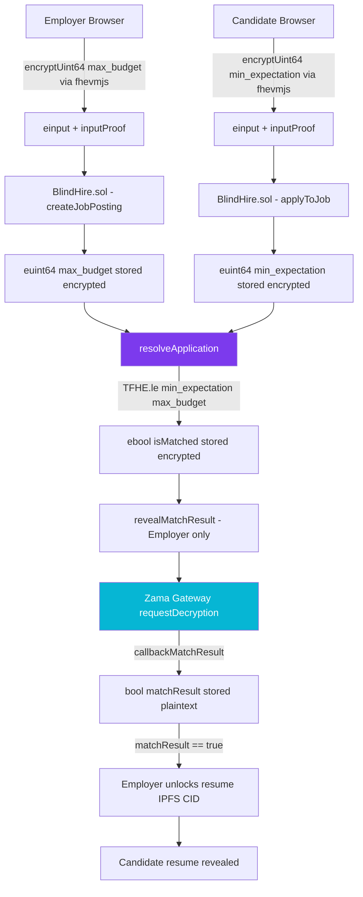

# BlindHire — Technical Architecture

## System Overview

BlindHire is a multi-layer confidential dApp powered by Zama's Fully Homomorphic Encryption (FHE). It operates across three layers:

1. **Browser (fhevmjs)** — Encrypts salary values client-side, never sending plaintext to any server
2. **Ethereum Smart Contract (Solidity + TFHE)** — Stores encrypted values and performs homomorphic computation
3. **Zama Gateway** — Decrypts specific `ebool` results and callbacks to the contract

---

## Architecture Diagram



---

## Data Flow — Step by Step

### Step 1: Job Posting (Employer)
```
Browser                    Contract                    Chain State
   |                           |                           |
   |── fhevmjs.encrypt(140000) |                           |
   |   → { handle, proof }     |                           |
   |                           |                           |
   |── createJobPosting() ────►|                           |
   |   (handle, proof)         |── TFHE.asEuint64() ──────►|
   |                           |   stores euint64           |
   |                           |   max_budget (ciphertext) |
```

### Step 2: Candidate Application
```
Browser                    Contract                    Chain State
   |                           |                           |
   |── fhevmjs.encrypt(120000) |                           |
   |   → { handle, proof }     |                           |
   |                           |                           |
   |── applyToJob() ──────────►|                           |
   |   (handle, proof)         |── TFHE.asEuint64() ──────►|
   |                           |   stores euint64           |
   |                           |   min_expectation (cipher)|
```

### Step 3: FHE Comparison (The Core)
```
Contract (on-chain computation, no decryption)
   |
   |── TFHE.le(min_expectation, max_budget)
   |   Both values remain encrypted throughout
   |   Result: ebool isMatched (still encrypted!)
   |
   |── Stores encrypted ebool → Application.isMatched
```

### Step 4: Gateway Reveal (Employer-triggered)
```
Contract            Zama Gateway         Contract
   |                     |                   |
   |── requestDecryption(isMatched) ────────►|
   |                     |                   |
   |                     |── Decrypts ebool  |
   |                     |── callbackMatchResult(jobId, appId, true/false)
   |◄────────────────────────────────────────|
   |── Stores matchResult (plaintext bool)   |
```

---

## Key FHE Primitives

| Primitive | Description | Used For |
|---|---|---|
| `euint64` | Encrypted 64-bit unsigned integer | max_budget, min_expectation |
| `ebool` | Encrypted boolean | isMatched result |
| `einput` | Raw encrypted input bytes (from fhevmjs) | Contract function parameters |
| `TFHE.asEuint64(einput, proof)` | Converts browser ciphertext to contract euint64 | Input ingestion |
| `TFHE.le(a, b)` | Homomorphic `a ≤ b` comparison returning `ebool` | Core matching logic |
| `TFHE.allowThis(handle)` | Grants the contract permission to use a ciphertext | ACL management |
| `TFHE.allow(handle, address)` | Grants a specific address permission | Employer access to ebool |
| `GatewayCaller` | Base contract enabling Zama Gateway decryption callbacks | Match reveal |

---

## Smart Contract Function Reference

| Function | Caller | Description |
|---|---|---|
| `createJobPosting()` | Employer | Posts job with encrypted max_budget via einput |
| `applyToJob()` | Candidate | Applies with encrypted min_expectation, saves IPFS CID |
| `resolveApplication()` | Anyone | Triggers TFHE.le() — stores encrypted ebool result |
| `revealMatchResult()` | Employer only | Requests Gateway decryption of ebool → bool |
| `callbackMatchResult()` | Zama Gateway | Receives plaintext bool, stores in Application |
| `unlockResume()` | Employer only | Unlocks IPFS CID access after confirmed match |
| `closeJob()` | Employer only | Deactivates job posting |
| `getActiveJobs()` | Anyone | Returns all active jobs (no salary data) |
| `getApplicationsForJob()` | Employer only | Returns applications metadata (no salary data) |
| `getMyApplications()` | Candidate | Returns own applications (no salary data) |
| `getResumeIfUnlocked()` | Employer only | Returns IPFS CID only if resume is unlocked |
| `getJobsByEmployer()` | Anyone | Returns job IDs created by an address |

---

## Access Control Matrix

| Data | Employer | Candidate | Public |
|---|---|---|---|
| Job title, company, location | ✅ | ✅ | ✅ |
| Encrypted max_budget | ✅ (as ciphertext) | ❌ | ❌ |
| Plaintext max_budget | ❌ | ❌ | ❌ |
| Encrypted min_expectation | ❌ | ✅ (as ciphertext) | ❌ |
| Plaintext min_expectation | ❌ | ❌ | ❌ |
| Match result (bool) | ✅ (after reveal) | ✅ (after reveal) | ❌ |
| Resume IPFS CID | ✅ (on match + unlock) | ✅ (own) | ❌ |

---

## Security Properties

1. **Salary Confidentiality**: Neither salary figure ever appears in plaintext on-chain, in events, in view functions, or in any return value
2. **Verifiable Fairness**: The TFHE.le() computation is verifiable on-chain — no intermediary can manipulate the result
3. **Access Control**: TFHE.allow() / TFHE.allowThis() ensure only authorized addresses can request decryption
4. **Input Authenticity**: `inputProof` ZKP ensures the encrypted value was created by the stated address — no replay attacks
5. **Separation of Concerns**: The contract stores results, the browser encrypts inputs, the Gateway decrypts specific outputs — no single point of compromise

---

## Frontend Architecture

```
web/src/
├── hooks/
│   ├── useFhevm.js      → Manages fhevmjs WASM lifecycle, exposes encryptUint64()
│   └── useContract.js   → Typed ethers.js contract calls + wallet management
├── components/
│   ├── Navbar.jsx       → Navigation + wallet connect
│   ├── Footer.jsx       → Footer with Etherscan link
│   ├── Animations.jsx   → Framer Motion helpers (PageTransition, FadeIn, TxOverlay)
│   └── EncryptionZone.jsx → The signature "lock" animation + salary slider
├── pages/
│   ├── Landing.jsx          → Hero + match visualizer + how-it-works
│   ├── JobBoard.jsx         → Public jobs grid (live + demo fallback)
│   ├── PostJob.jsx          → Employer: encrypt budget + post job
│   ├── ApplyJob.jsx         → Candidate: encrypt expectation + upload resume
│   ├── EmployerDashboard.jsx → Manage jobs, trigger FHE + Gateway flows
│   └── CandidateDashboard.jsx → Track application statuses
└── abi/
    └── BlindHire.json   → Contract ABI for ethers.js
```
