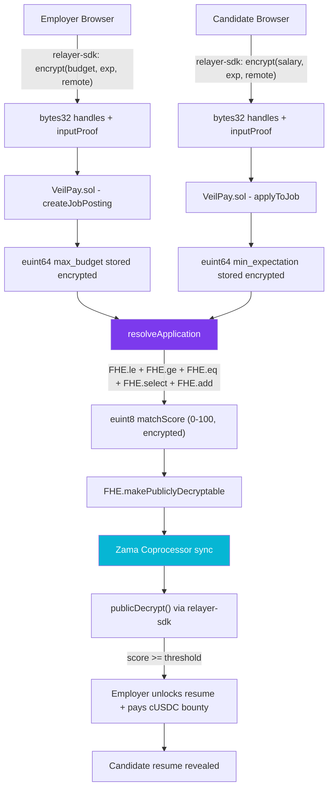

# BlindHire — Technical Architecture

## System Overview

BlindHire is a multi-layer confidential dApp powered by Zama's Fully Homomorphic Encryption (FHE). It operates across three layers:

1. **Browser (@zama-fhe/relayer-sdk)** — Encrypts salary, experience, and remote preference client-side via WASM, never sending plaintext to any server
2. **Ethereum Smart Contract (Solidity + FHE)** — Stores encrypted values and performs homomorphic computation using `FHE.*` operations
3. **Zama Coprocessor + KMS** — Processes FHE operations asynchronously and manages public decryptability flags

---

## Architecture Diagram



---

## Data Flow — Step by Step

### Step 1: Job Posting (Employer)
```
Browser                    Contract                    Chain State
   |                           |                           |
   |── relayer-sdk.encrypt()   |                           |
   |   add64(budget)           |                           |
   |   add8(experience)        |                           |
   |   addBool(remoteOk)       |                           |
   |   → { handles[], proof }  |                           |
   |                           |                           |
   |── createJobPosting() ────►|                           |
   |   (3 handles, proof)      |── Impl.verify() x3 ─────►|
   |                           |   FHE.allowThis()         |
   |                           |   stores euint64, euint8, |
   |                           |   ebool (all ciphertext)  |
```

### Step 2: Candidate Application
```
Browser                    Contract                    Chain State
   |                           |                           |
   |── relayer-sdk.encrypt()   |                           |
   |   add64(salary)           |                           |
   |   add8(experience)        |                           |
   |   addBool(remotePref)     |                           |
   |   → { handles[], proof }  |                           |
   |                           |                           |
   |── applyToJob() ──────────►|                           |
   |   (3 handles, proof)      |── Impl.verify() x3 ─────►|
   |                           |   FHE.allowThis()         |
   |                           |   stores euint64, euint8, |
   |                           |   ebool (all ciphertext)  |
```

### Step 3: Multi-Variable FHE Scoring (The Core)
```
Contract (onchain computation, no decryption)
   |
   |── FHE.le(candidateMin, employerMax)     → salaryMatch  (ebool)
   |── FHE.select(salaryMatch, 50, 0)        → salaryScore  (euint8)
   |
   |── FHE.ge(candidateExp, requiredExp)     → expMatch     (ebool)
   |── FHE.select(expMatch, 30, 0)           → expScore     (euint8)
   |
   |── FHE.eq(candidateRemote, employerPref) → remoteMatch  (ebool)
   |── FHE.select(remoteMatch, 20, 0)        → remoteScore  (euint8)
   |
   |── FHE.add(salary + exp + remote)        → totalScore   (euint8, 0-100)
   |
   |── FHE.makePubliclyDecryptable(totalScore)
   |── Stores encrypted euint8 → Application.matchScore
```

### Step 4: Self-Relaying Decryption (Employer-triggered)
```
Browser (relayer-sdk)     Zama Coprocessor        Contract
   |                           |                      |
   |── publicDecrypt(handle) ─►|                      |
   |                           |── Decrypts euint8    |
   |◄── clearValue (0-100) ───|                      |
   |                           |                      |
   |── revealMatchResult() ────────────────────────►  |
   |   (pass decrypted bool +  |                      |
   |    score as parameters)   |── Stores plaintext   |
   |                           |   matchResult + score|
```

---

## Key FHE Primitives (fhevm-solidity v0.11.x)

| Primitive | Description | Used For |
|---|---|---|
| `euint64` | Encrypted 64-bit unsigned integer | max_budget, min_expectation |
| `euint8` | Encrypted 8-bit unsigned integer | experience years, match score (0-100) |
| `euint32` | Encrypted 32-bit unsigned integer | aggregated review ratings |
| `ebool` | Encrypted boolean | remote preference, salary match result |
| `Impl.verify(handle, proof, FheType)` | Verifies browser-encrypted input and returns typed handle | Input ingestion |
| `FHE.le(a, b)` | Homomorphic `a ≤ b` comparison returning `ebool` | Salary matching |
| `FHE.ge(a, b)` | Homomorphic `a ≥ b` comparison returning `ebool` | Experience matching |
| `FHE.eq(a, b)` | Homomorphic equality check returning `ebool` | Remote preference matching |
| `FHE.select(cond, a, b)` | Encrypted ternary: if cond then a else b | Conditional scoring |
| `FHE.add(a, b)` | Homomorphic addition | Score aggregation, review aggregation |
| `FHE.asEuint8(val)` | Convert plaintext to encrypted uint8 | Score constants (50, 30, 20, 0) |
| `FHE.asEuint32(val)` | Upcast encrypted uint8 to uint32 | Review rating widening |
| `FHE.allowThis(handle)` | Grants the contract permission to use a ciphertext | ACL management |
| `FHE.allow(handle, address)` | Grants a specific address permission | Employer access |
| `FHE.makePubliclyDecryptable(handle)` | Marks a ciphertext for public decryption via coprocessor | Self-relaying reveal |

---

## Smart Contract Function Reference

| Function | Caller | Description |
|---|---|---|
| `createJobPosting()` | Employer | Posts job with 3 encrypted inputs (budget, exp, remote) + cUSDC bounty escrow |
| `applyToJob()` | Candidate | Applies with 3 encrypted inputs (salary, exp, remote) + IPFS resume |
| `resolveApplication()` | Anyone | Triggers multi-variable FHE scoring (9 FHE ops → euint8 score 0-100) |
| `revealMatchResult()` | Employer only | Stores decrypted match bool + score after client-side publicDecrypt() |
| `unlockResume()` | Employer only | Unlocks IPFS CID + auto-transfers cUSDC bounty to candidate |
| `closeJob()` | Employer only | Deactivates job + refunds remaining cUSDC bounty pool |
| `submitReview()` | Candidate | Submits encrypted 1-5 star rating, FHE.add aggregated anonymously |
| `requestRatingReveal()` | Anyone | Marks aggregated review score for public decryption |
| `commitRevealedRating()` | Owner | Stores decrypted average rating onchain |
| `sendMessage()` | Matched pair | FHE-gated chat — only unlocked after confirmed salary match |
| `getActiveJobs()` | Anyone | Returns all active jobs (no salary data) |
| `getApplicationsForJob()` | Employer only | Returns applications metadata (no salary data) |
| `getMyApplications()` | Candidate | Returns own applications (no salary data) |
| `getResumeIfUnlocked()` | Employer only | Returns IPFS CID only if resume is unlocked |
| `getJobsByEmployer()` | Anyone | Returns job IDs created by an address |

---

## Access Control Matrix

| Data | Employer | Candidate | Public |
|---|---|---|---|
| Job title, company, location | ✅ | ✅ | ✅ |
| Encrypted max_budget | ✅ (as ciphertext) | ❌ | ❌ |
| Plaintext max_budget | ❌ | ❌ | ❌ |
| Encrypted min_expectation | ❌ | ✅ (as ciphertext) | ❌ |
| Plaintext min_expectation | ❌ | ❌ | ❌ |
| Match score (0-100) | ✅ (after reveal) | ✅ (after reveal) | ❌ |
| Resume IPFS CID | ✅ (on match + unlock) | ✅ (own) | ❌ |
| Company review (individual) | ❌ | ❌ | ❌ |
| Company review (aggregate avg) | ✅ | ✅ | ✅ (after reveal) |
| FHE-gated chat messages | ✅ (if matched) | ✅ (if matched) | ❌ |

---

## Security Properties

1. **Salary Confidentiality**: Neither salary figure ever appears in plaintext onchain, in events, in view functions, or in any return value
2. **Verifiable Fairness**: The FHE.le() computation is verifiable onchain — no intermediary can manipulate the result
3. **Access Control**: FHE.allow() / FHE.allowThis() ensure only authorized addresses can interact with specific ciphertexts
4. **Input Authenticity**: `inputProof` ZKP ensures the encrypted value was created by the stated address — no replay attacks
5. **Review Anonymity**: FHE.add() aggregation makes individual ratings cryptographically unextractable from the onchain sum
6. **Bounty Safety**: ERC-20 transfer/transferFrom with balance checks; remaining pool refunded on job close
7. **Separation of Concerns**: The browser encrypts inputs, the contract computes on ciphertexts, the coprocessor manages decryptability — no single point of compromise

---

## Frontend Architecture

```
web/src/
├── hooks/
│   ├── useFhevm.js      → Manages @zama-fhe/relayer-sdk WASM lifecycle, exposes encrypt/decrypt
│   └── useContract.js   → Typed ethers.js contract calls + protocol stats
├── components/
│   ├── Navbar.jsx              → Navigation + wallet connect
│   ├── Footer.jsx              → Footer with Etherscan link
│   ├── Animations.jsx          → Framer Motion helpers (FadeIn, Stagger)
│   ├── ConnectWalletButton.jsx → Custom themed wallet UI (browser extension only)
│   ├── EncryptionZone.jsx      → The signature "lock" animation + salary slider
│   ├── TransactionOverlay.jsx  → Multi-step tx progress + per-step Etherscan links
│   ├── ReviewModal.jsx         → FHE-encrypted star rating modal
│   └── FheChat.jsx             → FHE-gated messaging between matched pairs
├── pages/
│   ├── Landing.jsx          → Hero + match visualizer + how-it-works + live stats
│   ├── JobBoard.jsx         → Public jobs grid with pagination + filters
│   ├── PostJob.jsx          → Employer: encrypt budget + post job + cUSDC faucet
│   ├── ApplyJob.jsx         → Candidate: encrypt expectation + upload resume
│   ├── EmployerDashboard.jsx → Scores, unlock, batch resolve/reveal, close/refund
│   ├── CandidateDashboard.jsx → Track apps, rate employers
│   └── FheProof.jsx         → FHE Proof Inspector (4-phase tx verification)
├── config/
│   └── wagmi.js             → Wagmi wallet configuration (Sepolia)
├── utils/
│   └── ipfs.js              → Pinata IPFS uploads
└── abi/
    └── BlindHire.json       → Contract ABI for ethers.js
```
